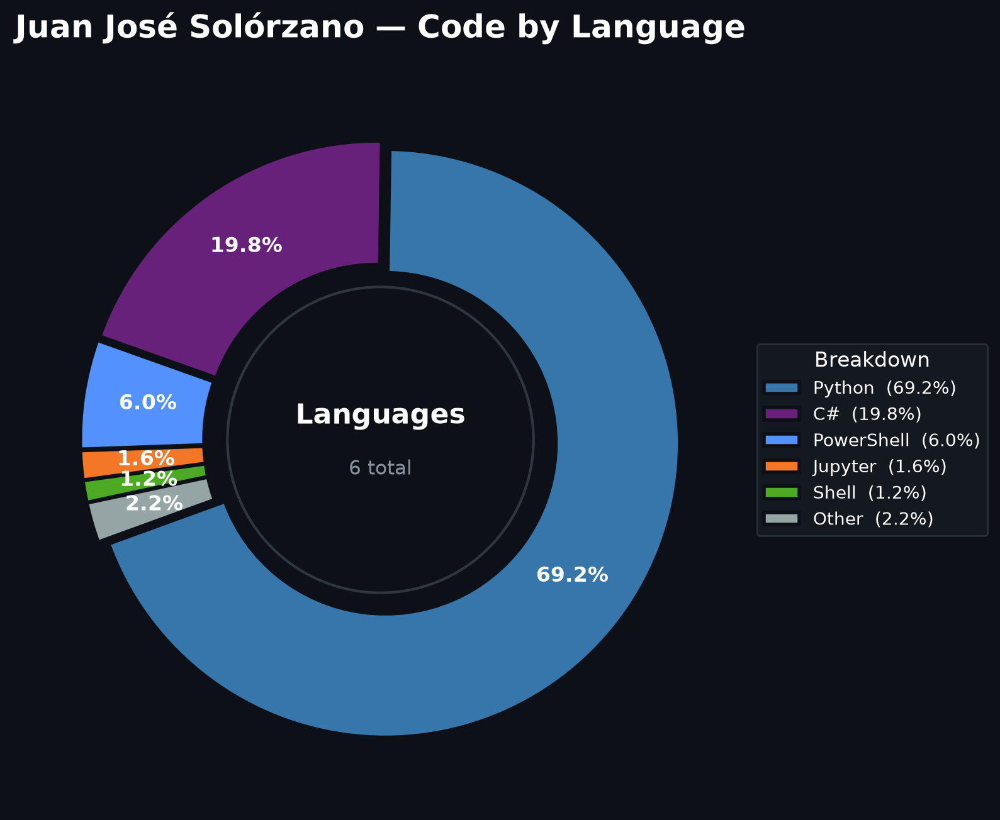

# 🌐 Portfolio

  <b>📦 60 repositories</b> &nbsp;|&nbsp;
  <b>🛠️ 22 languages</b> &nbsp;|&nbsp;
  <b>🔥 AI · Automation · DevTools · Games · CI/CD</b>

  
    🐍 <b>Python 69.2%</b> &nbsp;·&nbsp;
    🎮 <b>C# 19.8%</b> &nbsp;·&nbsp;
    🔷 <b>PowerShell 6.0%</b> &nbsp;·&nbsp;
    📓 <b>Jupyter 1.6%</b> &nbsp;·&nbsp;
    🐚 <b>Shell 1.2%</b> &nbsp;·&nbsp;
    ⚙️ <b>Other 2.2%</b>
  

---

## 🌐 All Repositories

<b>📂 Click to expand all repositories ▼</b>

 

🛠️ VS Code &amp; Git Extensions (11)

- [JuanJoseSolorzano/GitBranchesVscodeExtension](https://github.com/JuanJoseSolorzano/GitBranchesVscodeExtension)
- [JuanJoseSolorzano/GitCloneWithSubmodules](https://github.com/JuanJoseSolorzano/GitCloneWithSubmodules)
- [JuanJoseSolorzano/GitCommitWithAuthorVSVodeExtension](https://github.com/JuanJoseSolorzano/GitCommitWithAuthorVSVodeExtension)
- [JuanJoseSolorzano/GitFakeExtensionVSCodeExtension](https://github.com/JuanJoseSolorzano/GitFakeExtensionVSCodeExtension)
- [JuanJoseSolorzano/GitHelperExecutable](https://github.com/JuanJoseSolorzano/GitHelperExecutable)
- [JuanJoseSolorzano/GitRestoreBranch](https://github.com/JuanJoseSolorzano/GitRestoreBranch)
- [JuanJoseSolorzano/OpenFileWithExtensionVSCodeExtension](https://github.com/JuanJoseSolorzano/OpenFileWithExtensionVSCodeExtension)
- [JuanJoseSolorzano/OpenFileWithVSCodeExtension](https://github.com/JuanJoseSolorzano/OpenFileWithVSCodeExtension)
- [JuanJoseSolorzano/VSCodeConfigFiles](https://github.com/JuanJoseSolorzano/VSCodeConfigFiles)
- [JuanJoseSolorzano/VscodePythonEnvironment](https://github.com/JuanJoseSolorzano/VscodePythonEnvironment)
- [JuanJoseSolorzano/VscodeSettingsFiles](https://github.com/JuanJoseSolorzano/VscodeSettingsFiles)

🧠 AI / ML / Neural Networks (10)

- [JuanJoseSolorzano/EjemplosDeRedesNeuronalesMaster](https://github.com/JuanJoseSolorzano/EjemplosDeRedesNeuronalesMaster)
- [JuanJoseSolorzano/EmotionalRegulationForFAtiMA](https://github.com/JuanJoseSolorzano/EmotionalRegulationForFAtiMA)
- [JuanJoseSolorzano/EnglishAI](https://github.com/JuanJoseSolorzano/EnglishAI)
- [JuanJoseSolorzano/GeneticAlgorithmsExamples](https://github.com/JuanJoseSolorzano/GeneticAlgorithmsExamples)
- [JuanJoseSolorzano/Gpt3ModelTest](https://github.com/JuanJoseSolorzano/Gpt3ModelTest)
- [JuanJoseSolorzano/Gpt3WithGUI](https://github.com/JuanJoseSolorzano/Gpt3WithGUI)
- [JuanJoseSolorzano/IAUsingPython](https://github.com/JuanJoseSolorzano/IAUsingPython)
- [JuanJoseSolorzano/MachineLearning](https://github.com/JuanJoseSolorzano/MachineLearning)
- [JuanJoseSolorzano/PatternRecognitionMaster](https://github.com/JuanJoseSolorzano/PatternRecognitionMaster)
- [JuanJoseSolorzano/UnityGameAndEmotionRegulation](https://github.com/JuanJoseSolorzano/UnityGameAndEmotionRegulation)

🐍 Python Projects (5)

- [JuanJoseSolorzano/Catr](https://github.com/JuanJoseSolorzano/Catr)
- [JuanJoseSolorzano/CsharpAndPythonComm](https://github.com/JuanJoseSolorzano/CsharpAndPythonComm)
- [JuanJoseSolorzano/FileReader](https://github.com/JuanJoseSolorzano/FileReader)
- [JuanJoseSolorzano/PythonEnvWithCSharp](https://github.com/JuanJoseSolorzano/PythonEnvWithCSharp)
- [JuanJoseSolorzano/PythonScriptingTest](https://github.com/JuanJoseSolorzano/PythonScriptingTest)

☕ Java Projects (2)

- [JuanJoseSolorzano/JavaMasterPractices](https://github.com/JuanJoseSolorzano/JavaMasterPractices)
- [JuanJoseSolorzano/JavaProjectMaster](https://github.com/JuanJoseSolorzano/JavaProjectMaster)

💻 PowerShell / Windows Tools (11)

- [JuanJoseSolorzano/ArduinoInstaller](https://github.com/JuanJoseSolorzano/ArduinoInstaller)
- [JuanJoseSolorzano/ExecPS1Command](https://github.com/JuanJoseSolorzano/ExecPS1Command)
- [JuanJoseSolorzano/hackerpwm](https://github.com/JuanJoseSolorzano/hackerpwm)
- [JuanJoseSolorzano/PowershellInstaller](https://github.com/JuanJoseSolorzano/PowershellInstaller)
- [JuanJoseSolorzano/PowershellScriptingTest](https://github.com/JuanJoseSolorzano/PowershellScriptingTest)
- [JuanJoseSolorzano/PowershellSuite](https://github.com/JuanJoseSolorzano/PowershellSuite)
- [JuanJoseSolorzano/PowershellSuiteV1.0](https://github.com/JuanJoseSolorzano/PowershellSuiteV1.0)
- [JuanJoseSolorzano/PythonEnvWithPwsh](https://github.com/JuanJoseSolorzano/PythonEnvWithPwsh)
- [JuanJoseSolorzano/TerminalInstaller](https://github.com/JuanJoseSolorzano/TerminalInstaller)
- [JuanJoseSolorzano/WindowsMics](https://github.com/JuanJoseSolorzano/WindowsMics)
- [JuanJoseSolorzano/WindowsRightClick](https://github.com/JuanJoseSolorzano/WindowsRightClick)

🐧 Linux / Vim / Config Files (5)

- [JuanJoseSolorzano/BashBanditGame](https://github.com/JuanJoseSolorzano/BashBanditGame)
- [JuanJoseSolorzano/ChadNvimCnfFiles](https://github.com/JuanJoseSolorzano/ChadNvimCnfFiles)
- [JuanJoseSolorzano/LinuxConfigurationFiles](https://github.com/JuanJoseSolorzano/LinuxConfigurationFiles)
- [JuanJoseSolorzano/OwnCmpNvimWithCopilot](https://github.com/JuanJoseSolorzano/OwnCmpNvimWithCopilot)
- [JuanJoseSolorzano/VimAhkAutoHotkey](https://github.com/JuanJoseSolorzano/VimAhkAutoHotkey)

🔧 CI/CD &amp; DevOps (5)

- [JuanJoseSolorzano/ci-cd-final-project](https://github.com/JuanJoseSolorzano/ci-cd-final-project)
- [JuanJoseSolorzano/DatabasesMaster](https://github.com/JuanJoseSolorzano/DatabasesMaster)
- [JuanJoseSolorzano/DummyJenkinsRepo](https://github.com/JuanJoseSolorzano/DummyJenkinsRepo)
- [JuanJoseSolorzano/PipelineExampleJenkins](https://github.com/JuanJoseSolorzano/PipelineExampleJenkins)
- [JuanJoseSolorzano/ScottPlot](https://github.com/JuanJoseSolorzano/ScottPlot)

🔌 Jira Tools (4)

- [JuanJoseSolorzano/GetJiraInfo](https://github.com/JuanJoseSolorzano/GetJiraInfo)
- [JuanJoseSolorzano/GetJiraTicket](https://github.com/JuanJoseSolorzano/GetJiraTicket)
- [JuanJoseSolorzano/SetJiraComment](https://github.com/JuanJoseSolorzano/SetJiraComment)
- [JuanJoseSolorzano/SetJiraTime](https://github.com/JuanJoseSolorzano/SetJiraTime)

📄 Resume / Web / GitHub Pages (5)

- [JuanJoseSolorzano/JuanJoseSolorzano](https://github.com/JuanJoseSolorzano/JuanJoseSolorzano)
- [JuanJoseSolorzano/JuanJoseSolorzano.github.io](https://github.com/JuanJoseSolorzano/JuanJoseSolorzano.github.io)
- [JuanJoseSolorzano/LegacyJuanjosesolo.github.io](https://github.com/JuanJoseSolorzano/LegacyJuanjosesolo.github.io)
- [JuanJoseSolorzano/MyLaTeXResume](https://github.com/JuanJoseSolorzano/MyLaTeXResume)
- [JuanJoseSolorzano/ResumeTemplate](https://github.com/JuanJoseSolorzano/ResumeTemplate)

🎮 Games &amp; Misc (2)

- [JuanJoseSolorzano/PracticeC](https://github.com/JuanJoseSolorzano/PracticeC)
- [JuanJoseSolorzano/RockPaperScissorsGameMaster](https://github.com/JuanJoseSolorzano/RockPaperScissorsGameMaster)

---

  ⚡ Auto-updated every hour by GitHub Actions

