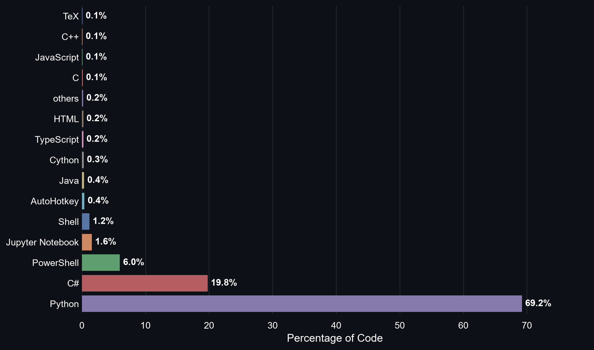

# 🌐 Portfolio

  <b>📦 60 repositories</b> &nbsp;|&nbsp;
  <b>🛠️ 22 languages</b> &nbsp;|&nbsp;
  <b>🔥 AI · Automation · DevTools · Games · CI/CD</b>

  
    🐍 <b>Python 69.2%</b> &nbsp;·&nbsp;
    🎮 <b>C# 19.8%</b> &nbsp;·&nbsp;
    🔷 <b>PowerShell 6.0%</b> &nbsp;·&nbsp;
    📓 <b>Jupyter 1.6%</b> &nbsp;·&nbsp;
    🐚 <b>Shell 1.2%</b> &nbsp;·&nbsp;
    ⚙️ <b>Other 2.2%</b>
  

---

## 🌐 All Repositories

<b>📂 Click to expand all repositories ▼</b>

 

🛠️ VS Code &amp; Git Extensions (11)

- [GitBranchesVscodeExtension](https://github.com/JuanJoseSolorzano/GitBranchesVscodeExtension)
- [GitCloneWithSubmodules](https://github.com/JuanJoseSolorzano/GitCloneWithSubmodules)
- [GitCommitWithAuthorVSVodeExtension](https://github.com/JuanJoseSolorzano/GitCommitWithAuthorVSVodeExtension)
- [GitFakeExtensionVSCodeExtension](https://github.com/JuanJoseSolorzano/GitFakeExtensionVSCodeExtension)
- [GitHelperExecutable](https://github.com/JuanJoseSolorzano/GitHelperExecutable)
- [GitRestoreBranch](https://github.com/JuanJoseSolorzano/GitRestoreBranch)
- [OpenFileWithExtensionVSCodeExtension](https://github.com/JuanJoseSolorzano/OpenFileWithExtensionVSCodeExtension)
- [OpenFileWithVSCodeExtension](https://github.com/JuanJoseSolorzano/OpenFileWithVSCodeExtension)
- [VSCodeConfigFiles](https://github.com/JuanJoseSolorzano/VSCodeConfigFiles)
- [VscodePythonEnvironment](https://github.com/JuanJoseSolorzano/VscodePythonEnvironment)
- [VscodeSettingsFiles](https://github.com/JuanJoseSolorzano/VscodeSettingsFiles)

🧠 AI / ML / Neural Networks (10)

- [EjemplosDeRedesNeuronalesMaster](https://github.com/JuanJoseSolorzano/EjemplosDeRedesNeuronalesMaster)
- [EmotionalRegulationForFAtiMA](https://github.com/JuanJoseSolorzano/EmotionalRegulationForFAtiMA)
- [EnglishAI](https://github.com/JuanJoseSolorzano/EnglishAI)
- [GeneticAlgorithmsExamples](https://github.com/JuanJoseSolorzano/GeneticAlgorithmsExamples)
- [Gpt3ModelTest](https://github.com/JuanJoseSolorzano/Gpt3ModelTest)
- [Gpt3WithGUI](https://github.com/JuanJoseSolorzano/Gpt3WithGUI)
- [IAUsingPython](https://github.com/JuanJoseSolorzano/IAUsingPython)
- [MachineLearning](https://github.com/JuanJoseSolorzano/MachineLearning)
- [PatternRecognitionMaster](https://github.com/JuanJoseSolorzano/PatternRecognitionMaster)
- [UnityGameAndEmotionRegulation](https://github.com/JuanJoseSolorzano/UnityGameAndEmotionRegulation)

🐍 Python Projects (5)

- [Catr](https://github.com/JuanJoseSolorzano/Catr)
- [CsharpAndPythonComm](https://github.com/JuanJoseSolorzano/CsharpAndPythonComm)
- [FileReader](https://github.com/JuanJoseSolorzano/FileReader)
- [PythonEnvWithCSharp](https://github.com/JuanJoseSolorzano/PythonEnvWithCSharp)
- [PythonScriptingTest](https://github.com/JuanJoseSolorzano/PythonScriptingTest)

☕ Java Projects (2)

- [JavaMasterPractices](https://github.com/JuanJoseSolorzano/JavaMasterPractices)
- [JavaProjectMaster](https://github.com/JuanJoseSolorzano/JavaProjectMaster)

💻 PowerShell / Windows Tools (11)

- [ArduinoInstaller](https://github.com/JuanJoseSolorzano/ArduinoInstaller)
- [ExecPS1Command](https://github.com/JuanJoseSolorzano/ExecPS1Command)
- [hackerpwm](https://github.com/JuanJoseSolorzano/hackerpwm)
- [PowershellInstaller](https://github.com/JuanJoseSolorzano/PowershellInstaller)
- [PowershellScriptingTest](https://github.com/JuanJoseSolorzano/PowershellScriptingTest)
- [PowershellSuite](https://github.com/JuanJoseSolorzano/PowershellSuite)
- [PowershellSuiteV1.0](https://github.com/JuanJoseSolorzano/PowershellSuiteV1.0)
- [PythonEnvWithPwsh](https://github.com/JuanJoseSolorzano/PythonEnvWithPwsh)
- [TerminalInstaller](https://github.com/JuanJoseSolorzano/TerminalInstaller)
- [WindowsMics](https://github.com/JuanJoseSolorzano/WindowsMics)
- [WindowsRightClick](https://github.com/JuanJoseSolorzano/WindowsRightClick)

🐧 Linux / Vim / Config Files (5)

- [BashBanditGame](https://github.com/JuanJoseSolorzano/BashBanditGame)
- [ChadNvimCnfFiles](https://github.com/JuanJoseSolorzano/ChadNvimCnfFiles)
- [LinuxConfigurationFiles](https://github.com/JuanJoseSolorzano/LinuxConfigurationFiles)
- [OwnCmpNvimWithCopilot](https://github.com/JuanJoseSolorzano/OwnCmpNvimWithCopilot)
- [VimAhkAutoHotkey](https://github.com/JuanJoseSolorzano/VimAhkAutoHotkey)

🔧 CI/CD &amp; DevOps (5)

- [ci-cd-final-project](https://github.com/JuanJoseSolorzano/ci-cd-final-project)
- [DatabasesMaster](https://github.com/JuanJoseSolorzano/DatabasesMaster)
- [DummyJenkinsRepo](https://github.com/JuanJoseSolorzano/DummyJenkinsRepo)
- [PipelineExampleJenkins](https://github.com/JuanJoseSolorzano/PipelineExampleJenkins)
- [ScottPlot](https://github.com/JuanJoseSolorzano/ScottPlot)

🔌 Jira Tools (4)

- [GetJiraInfo](https://github.com/JuanJoseSolorzano/GetJiraInfo)
- [GetJiraTicket](https://github.com/JuanJoseSolorzano/GetJiraTicket)
- [SetJiraComment](https://github.com/JuanJoseSolorzano/SetJiraComment)
- [SetJiraTime](https://github.com/JuanJoseSolorzano/SetJiraTime)

📄 Resume / Web / GitHub Pages (5)

- [JuanJoseSolorzano](https://github.com/JuanJoseSolorzano/JuanJoseSolorzano)
- [JuanJoseSolorzano.github.io](https://github.com/JuanJoseSolorzano/JuanJoseSolorzano.github.io)
- [LegacyJuanjosesolo.github.io](https://github.com/JuanJoseSolorzano/LegacyJuanjosesolo.github.io)
- [MyLaTeXResume](https://github.com/JuanJoseSolorzano/MyLaTeXResume)
- [ResumeTemplate](https://github.com/JuanJoseSolorzano/ResumeTemplate)

🎮 Games &amp; Misc (2)

- [PracticeC](https://github.com/JuanJoseSolorzano/PracticeC)
- [RockPaperScissorsGameMaster](https://github.com/JuanJoseSolorzano/RockPaperScissorsGameMaster)

---

  ⚡ Auto-updated every hour by GitHub Actions

